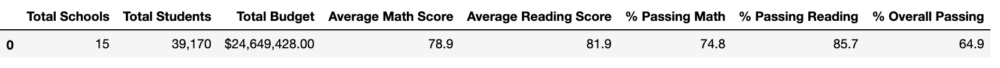
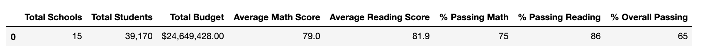
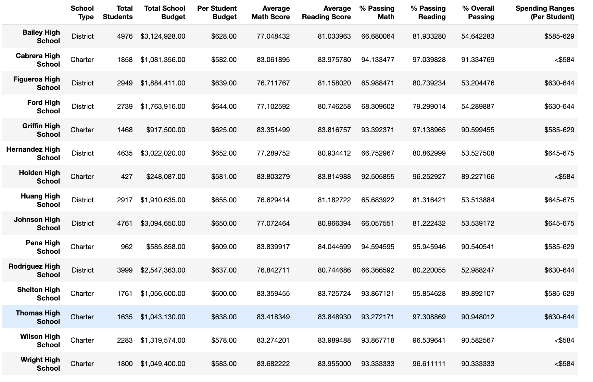
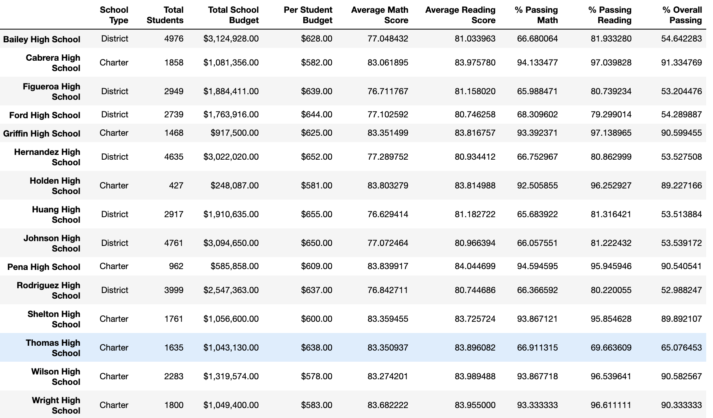

# School_District_Analysis
written in python using anaconda and jupyter
# Overview and Purpose
Maria is the chief data scientist for a city school district and she is tasked with analyzing data in different formats and uncovering trends in the data set.  The trends and insights found uncovered in the data set will help make decisions about test score trends and performance at different schools, as well as budgeting information.

## Purpose
In this challenge we wanted to:
1) see how the dishonesty altered overall district data
2) replace Thomas High School data with NaN, while keeping rest of data intact
3) re-perform the analysis in the module
4) compare results of two analysis's 

# Results

## Effects on School District Summary:

District Challenge Summary:

District Module Summary:

- The average scores from the challenge from the module didn't vary very much at all as you can see from the percentages

## Effects on the School Summary:

School Summary Module:

School Summary Challenge:

- By looking at the data frames, it's easy to see the changes in the data between the module grades and the challenge grades.

### Module data Thomas High School:

* percentage passing (math): 93.2%
* percentage passing (reading): 97.3%
* average math score: 83.4
* average reading score: 83.8
* Overall passing: 90.9%

### Challenge data Thomas High School:

* percentage passing (math): 66.9%
* percentage passing (reading): 69.6%
* average math score: 83.3
* average reading score: 83.8
* Overall passing: 65%

** By replacing the ninth graders math and reading scores, their overall passing percentage was at 65% whereas before the grades were substituted, the overall passing percentage was 91% **

## What affect does removing the scores have on the data?

- Replacing the ninth grade math and reading scores overall doesn't have a major effect on  the district summary.  However, there are visible changes within the school summaries.

Based on the changes in the data:
1) Scores by school size remained the same
2) Scores by school spending changed at the $630-$644 range
3) The percentage passing for both reading and math dropped from the removal of ninth grade grades.
4) The scores by school type remained the same

# Major changes in the school analysis after changes

- The math and reading scores for the ninth grade were replaced by NaN's in order to remove the faulty grades and leave the rest of the data intact.
- There were marginal changes in the Scores based on school spending
- The changes did not effect the scores by school size or type
- The district summary was most drastically affected by the changes made in the data

